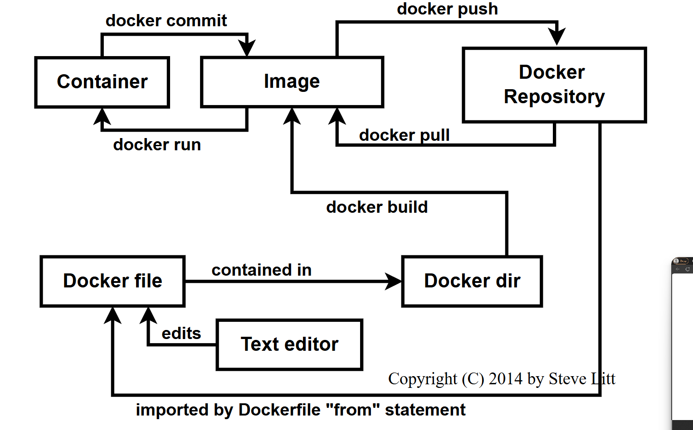

# Docker

<figure><figcaption></figcaption></figure>

<figure><figcaption></figcaption></figure>

## Шпаргалка по интерфейсу CLI&#x20;

## Образы

Образы Docker - это легкий, автономный, исполняемый пакет программного обеспечения, который включает в себя все необходимое для запуска приложения: код, среду выполнения, системные инструменты, системные библиотеки и настройки.

```
Cделать образ из Dockerfile
docker build -t <image_name>

Cделать образ из Dockerfile без кэша
docker build -t <image_name> . –no-cache

Отобразить список локальных образов
docker images

Удалить образ
docker rmi <image_name>

Удалить неиспользуемые образы
docker image prune
```

## DOCKER HUB&#x20;

Docker Hub - это сервис, предоставляемый компанией Docker для поиска образов  контейнеров и обмена ими с вашей командой. Узнайте больше и найдите изображения на сайте https://hub.docker.com

```
Войти в dh
docker login -u <username>

Опубликовать  Docker Hub
docker push <username>/<image_name>

Поиск образа
docker search <image_name>

Забрать образ с dh
docker pull <image_name>
```

## ОБЩИЕ КОМАНДЫ

```
Стартовать демон docker
docker -d

Справочная информация
docker --help
docker info
```

## КОНТЕЙНЕРЫ

Контейнер - это исполняемый экземпляр образа docker. Контейнер всегда будет работать одинаково, независимо от инфраструктуры. Контейнеры изолируют программное обеспечение от его среды и обеспечивают его единообразную работу, несмотря на различия, например, между разработкой и промежуточным этапом.

```
docker run [OPTIONS] IMAGE [COMMAND] [ARG...]

Созать контейнер из образа и задать имя контейнера
docker run --name <container_name> <image_name>

Запустить контейнер и сделать проброс портов
docker run -p <host_port>:<container_port> <image_name>

Запустить контейнер в фоновом режиме
docker run -d <image_name>

Стартовать или остановить контейнер
docker start|stop <container_name> (or <container-id>)

Удалить остановленные контейнеры
docker rm <container_name>

Открыть интерактивную консоль внутри контейнера(в данном случае shell)
docker exec -it <container_name> sh

Просмотр логов контейнера:
docker logs -f <container_name>

Инспетирование контейнера:
docker inspect <container_name> (or <container_id>)

Список запущенных контейнеров:
docker ps

Список всех контейнеров(running and stopped):
docker ps --all

Список ресурсов используемых контейнером:
docker container stats
```

## ФИКСАЦИЯ ИЗМЕНИЙ В ОБРАЗАХ DOCKER(docker commit)

Может оказаться полезным перенести изменения или настройки файла контейнера в новый образ. Это позволяет отлаживать контейнер, запуская интерактивную оболочку, или экспортировать рабочий набор данных на другой сервер.

При фиксации  не учитываются данные, содержащиеся в подключенных томах.

По умолчанию фиксируемый контейнер и его процессы будут приостановлены на время фиксации образа. Это снижает вероятность повреждения данных в процессе создания фиксации. Если такое поведение нежелательно, установите для параметра --pause значение false.

Параметр --change применит инструкции из файла Dockerfile к созданному образу. Поддерживаемые инструкции из файла Dockerfile: CMD|ENTRYPOINT|ENV|EXPOSE|LABEL|ONBUILD|USER|VOLUME|WORKDIR

```
Опции
-a, --author		Author (e.g., John Hannibal Smith <hannibal@a-team.com>)
-c, --change		Apply Dockerfile instruction to the created image
-m, --message		Commit message
-p, --pause	true	Pause container during commit
```

Синтаксис

```
docker commit [OPTIONS] CONTAINER [REPOSITORY[:TAG]]
```

## Dockerfile&#x20;

Docker может автоматически создавать образы, считывая инструкции из файла Dockerfile. Файл Dockerfile - это текстовый документ, содержащий все команды, которые пользователь может вызвать в командной строке для создания образа.

| Инструкция                                                                          | Описание                                                   |
| ----------------------------------------------------------------------------------- | ---------------------------------------------------------- |
| [`ADD`](https://docs.docker.com/reference/dockerfile/#add)                          | Добавьте локальные или удаленные файлы и каталоги.         |
| [`ARG`](https://docs.docker.com/reference/dockerfile/#arg)                          | Используйте переменные времени сборки.                     |
| [`CMD`](https://docs.docker.com/reference/dockerfile/#cmd)                          | Укажите команды по умолчанию.                              |
| [`COPY`](https://docs.docker.com/reference/dockerfile/#copy)                        | Скопируйте файлы и каталоги.                               |
| [`ENTRYPOINT`](https://docs.docker.com/reference/dockerfile/#entrypoint)            | Укажите исполняемый файл по умолчанию.                     |
| [`ENV`](https://docs.docker.com/reference/dockerfile/#env)                          | Установите переменные среды.                               |
| [`EXPOSE`](https://docs.docker.com/reference/dockerfile/#expose)                    | Опишите, какие порты прослушивает ваше приложение.         |
| [`FROM`](https://docs.docker.com/reference/dockerfile/#from)                        | Создайте новый этап сборки из базового образа.             |
| [`HEALTHCHECK`](https://docs.docker.com/reference/dockerfile/#healthcheck)          | Проверьте работоспособность контейнера при запуске.        |
| [`LABEL`](https://docs.docker.com/reference/dockerfile/#label)                      | Добавление метаданных к образа.                            |
| [`MAINTAINER`](https://docs.docker.com/reference/dockerfile/#maintainer-deprecated) | Укажите автора образа.                                     |
| [`ONBUILD`](https://docs.docker.com/reference/dockerfile/#onbuild)                  | Укажите инструкции для использования образа в сборке.      |
| [`RUN`](https://docs.docker.com/reference/dockerfile/#run)                          | Выполните команды сборки.                                  |
| [`SHELL`](https://docs.docker.com/reference/dockerfile/#shell)                      | Установите оболочку образа по умолчанию.                   |
| [`STOPSIGNAL`](https://docs.docker.com/reference/dockerfile/#stopsignal)            | Укажите сигнал системного вызова для выхода из контейнера. |
| [`USER`](https://docs.docker.com/reference/dockerfile/#user)                        | Задайте идентификатор пользователя и группы.               |
| [`VOLUME`](https://docs.docker.com/reference/dockerfile/#volume)                    | Создайте монтирование тома.                                |
| [`WORKDIR`](https://docs.docker.com/reference/dockerfile/#workdir)                  | Измените рабочий каталог.                                  |

## Формат

```
# Comment
INSTRUCTION arguments
```

Инструкция не чувствительна к регистру. Однако принято писать их в ВЕРХНЕМ РЕГИСТРЕ, чтобы их было легче отличить от аргументов.

Docker выполняет инструкции в Dockerfile по порядку. Dockerfile **должен начинаться с `FROM` инструкции**. Она может располагаться после [директив синтаксического анализатора](https://docs.docker.com/reference/dockerfile/#parser-directives), [комментариев](https://docs.docker.com/reference/dockerfile/#format) и [аргументов](https://docs.docker.com/reference/dockerfile/#arg) с глобальной областью видимости. Инструкция `FROM` указывает [базовый образ](https://docs.docker.com/glossary/#parent-image), на основе которого выполняется сборка. `FROM` Ей может предшествовать только одна&#x20;




Для обратной совместимости ведущие пробелы перед комментариями (`#`) и инструкциями (например, `RUN`) игнорируются, но не рекомендуются. В этих случаях ведущие пробелы не сохраняются.

Однако пробелы в аргументах инструкций не игнорируются.




Пример Docker файла

```
FROM python:3.7.2-alpine3.8
LABEL maintainer="jeffmshale@gmail.com"
# Устанавливаем зависимости
RUN apk add --update git
# Задаём текущую рабочую директорию
WORKDIR /usr/src/my_app_directory
# Копируем код из локального контекста в рабочую директорию образа
COPY . .
# Задаём значение по умолчанию для переменной
ARG my_var=my_default_value
# Настраиваем команду, которая должна быть запущена в контейнере во время его выполнения
ENTRYPOINT ["python", "./app/my_script.py", "my_var"]
# Открываем порты
EXPOSE 8000
# Создаём том для хранения данных
VOLUME /my_volume
```

## Постоянное хранение данных

\
Существуют два способа, позволяющих сделать срок жизни данных большим срока жизни контейнера. Один из способов заключается в использовании технологии bind mount. При таком подходе к контейнеру можно примонтировать, например, реально существующую папку. Работать с данными, хранящимися в такой папке, смогут и процессы, находящиеся за пределами Docker. Вот как [выглядят](https://docs.docker.com/storage/volumes/) монтирование tmpfs и технология bind mount.\
\


\
&#xNAN;_&#x41C;онтирование tmpfs и bind mount_\
\
Минусы использования технологии bind mount заключаются в том, что её использование усложняет резервное копирование данных, миграцию данных, совместное использование данных несколькими контейнерами. Гораздо лучше для постоянного хранения данных использовать тома Docker.


Из командной строки

```yaml
docker run -it --mount type=bind,source=/tmp/a.txt,target=/root/a.txt alpine sh
```

## Тома Docker

\
Том — это файловая система, которая расположена на хост-машине за пределами контейнеров. Созданием и управлением томами занимается Docker. Вот основные свойства томов Docker:

* Они представляют собой средства для постоянного хранения информации.
* Они самостоятельны и отделены от контейнеров.
* Ими могут совместно пользоваться разные контейнеры.
* Они позволяют организовать эффективное чтение и запись данных.
* Тома можно размещать на ресурсах удалённого облачного провайдера.
* Их можно шифровать.
* Им можно давать имена.
* Контейнер может организовать заблаговременное наполнение тома данными.
* Они удобны для тестирования.

Примеры:

Командная строка

```
$ docker run -it -v my_volume:/dconfig debian:latest
```

