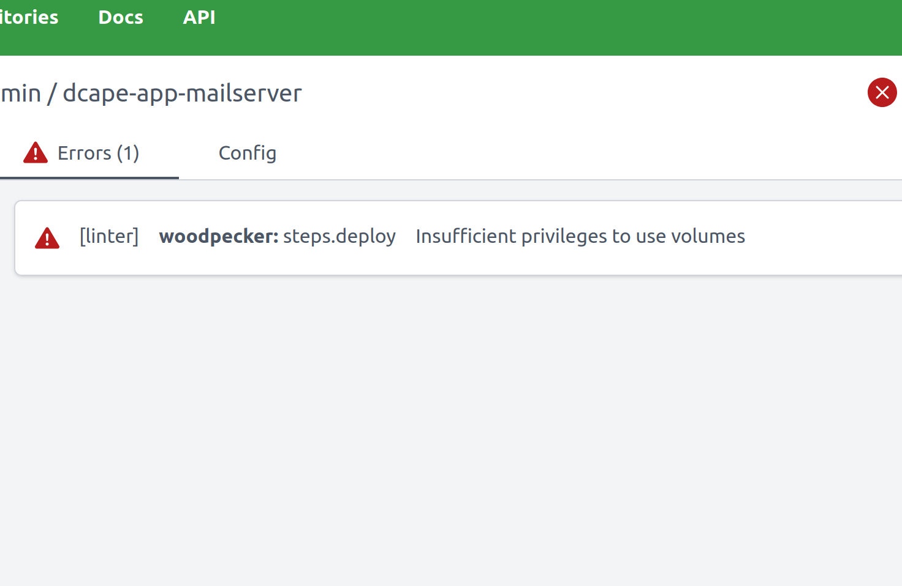

# Dcape

DCAPE - аббревиатура от “**D**ocker **c**omposed **ap**plication **e**nvironment”.

[Dcape](https://github.com/dopos/dcape) - это инструмент создания окружения (среды) для развёртывания [docker](https://www.docker.com/)-приложений по технологии [GitOps](https://www.gitops.tech/). Такое развёртывание состоит из нескольких этапов, для каждого из которых уже существуют opensource-решения (сервисы), но и их, в свою очередь, необходимо сконфигурировать и развернуть. **Dcape**, с помощью [make](https://www.gnu.org/software/make/) и [docker-compose](https://docs.docker.com/compose/), позволяет решить следующие задачи:

* сконфигурировать и развернуть [сервисы](https://dopos.github.io/dcape/coreapps/) для всех этапов развёртывания приложений
* сформулировать [правила адаптации приложений](https://dopos.github.io/dcape/usage/apps/) к стеку сервисов **dcape**

Цель создания **dcape** - получить относительно удобный способ запуска docker-приложений простой короткой командой, например

* `make up` - локально
* `git push` - удаленно

Главная проблема была в том, как повесить несколько контейнеров на порт 80, чтобы запросы к ним проксировались по имени хоста не на основании заранее руками созданного конфига, а по факту старта контейнера - эту задачу решил [traefik](https://traefik.io/).\
Бонусом он добавил TLS, т.е. возможность получения сертификата для хоста или, когда хостов много - для домена (т.е. wildcard-домена)

При использовании `traefik` приложение может управлять своей доступностью извне посредством меток (label) docker-контейнера, задавать которые можно в файле `docker-compose.yml`

Проект dcape - это попытка достичь требуемых целей с помощью `traefik`, `docker-compose` и минимального количества дополнительного кода.

## Настройка DNS

Dcape разворачивается и используется на локальном компьютере, в т.ч. если у этого компьютера нет сетевых интерфейсов.

Т.к. сервисы **dcape** общаются между собой, их hostname нельзя привязать к `loopback`- интерфейсу. В качестве ip-адреса можно использовать шлюз подсети dcape, которая задается параметром `DCAPE_SUBNET` (по умолчанию, подсеть - 100.127.0.0/24 и шлюз - 100.127.0.1):

```bash
grep -q " your_server.ltd" /etc/hosts || \
sudo bash -c 'for n in "" git drone port ns ; do [ "$n" ] && n="$n." ; echo "100.127.0.1 ${n}your_server.ltd" >> /etc/hosts ; done'

```

<mark style="color:red;">В v3 cicd (woodpcaker) >> drone</mark>

```bash
grep -q " your_server.ltd" /etc/hosts || \
sudo bash -c 'for n in "" git cicd port ns ; do [ "$n" ] && n="$n." ; echo "100.127.0.1 ${n}your_server.ltd" >> /etc/hosts ; done'
```

```bash
cat /etc/hosts
127.0.0.1	localhost
127.0.1.1	your_server.ltd

# The following lines are desirable for IPv6 capable hosts
::1     ip6-localhost ip6-loopback
fe00::0 ip6-localnet
ff00::0 ip6-mcastprefix
ff02::1 ip6-allnodes
ff02::2 ip6-allrouters
100.127.0.1 your_server.ltd
100.127.0.1 git.your_server.ltd
#100.127.0.1 drone.conf.sao.ru
100.127.0.1 port.your_server.ltd
100.127.0.1 ns.your_server.ltd
100.127.0.1 cicd.your_server.ltd #!!

```

## Установка

```bash
cd /opt
sudo mkdir dcape && sudo chown $USER dcape
git clone --depth 1 https://github.com/dopos/dcape.git
cd dcape
```

## Настройка и запуск <a href="#nastroika-i-zapusk" id="nastroika-i-zapusk"></a>

## Локальный сервер <a href="#lokalnyi-server" id="lokalnyi-server"></a>

Вариант без поддержки SSL, но с установкой gitea. Выполняется в 3 шага, т.к. на шаге 2 необходимо использовать браузер для

* завершения установки gitea
* создания API TOKEN

**Подготовка к запуску gitea**

```bash
make init DCAPE_DOMAIN=your_server.ltd
make apply
make up
```

<mark style="color:red;">make: \*\*\* Нет правила для сборки цели «init». Останов</mark>

```
make install DCAPE_DOMAIN=your_server.ltd
```

```
Dcape URL: http://your_server.ltd
------------------------------------------
NAME                 IMAGE                                          COMMAND                  SERVICE      CREATED                  STATUS                             PORTS
dcape-auth-1         ghcr.io/dopos/narra:v0.26.3                    "/app --as.host http…"   auth         45 seconds ago           Up 45 seconds                      8080/tcp
dcape-cicd-1         woodpeckerci/woodpecker-server:v2.0.0-alpine   "/bin/woodpecker-ser…"   cicd         30 seconds ago           Up 29 seconds (health: starting)   80/tcp, 443/tcp, 8000/tcp, 9000/tcp
dcape-cicd-agent-1   woodpeckerci/woodpecker-agent:v2.0.0-alpine    "/bin/woodpecker-age…"   cicd-agent   30 seconds ago           Up 30 seconds (health: starting)   3000/tcp
dcape-config-1       ghcr.io/apisite/app-enfist:v0.6.12             "/usr/bin/apisite --…"   config       38 seconds ago           Up 37 seconds                      8080/tcp
dcape-db-1           postgres:15.2                                  "docker-entrypoint.s…"   db           About a minute ago       Up About a minute (healthy)        127.0.0.1:5433->5432/tcp
dcape-manager-1      portainer/portainer-ce:2.19.4-alpine           "/portainer"             manager      Less than a second ago   Up Less than a second              8000/tcp, 9000/tcp, 9443/tcp
dcape-router-1       traefik:2.11.3                                 "/entrypoint.sh trae…"   router       About a minute ago       Up About a minute                  0.0.0.0:80->80/tcp, :::80->80/tcp, 0.0.0.0:443->443/tcp, :::443->443/tcp
dcape-vcs-1          gitea/gitea:1.21.2                             "/usr/bin/entrypoint…"   vcs          56 seconds ago           Up 55 seconds (healthy)            3000/tcp, 0.0.0.0:10022->22/tcp, :::10022->22/tcp
2024-11-12 15:50:51+03:00 ======================================== Dcape install done

```

Узнаем пароль от getea командой&#x20;

`make echo-gitea-admin-pass`

Ifпереходим по адресу http://git.your\_server.ltd

Логин dcapeadmin&#x20;

Убеждаемся что есть токен для cdci

<figure><figcaption><p> </p></figcaption></figure>

## Попытка деплоя приложений gitea+cicd

Для тестов взял пару адаптированных под dcape приложений:  [dcape-app-nginx-sample](https://github.com/dopos/dcape-app-nginx-sample), и, поскольку одна из ближаших задач настроить связку почтовый сервер + веб доступ к нему для пользователей - [dcape-app-mailserver](https://github.com/dopos/dcape-app-mailserver).

Клонируем репозетории в gitea:

<figure><figcaption></figcaption></figure>

Активируем репозиторий в cicd:

<figure><figcaption></figcaption></figure>

Пробуем запустить и получаем ошибку

<figure><figcaption></figcaption></figure>

Нужно сделать доверенным


<figure><figcaption></figcaption></figure>

Пробуем перезапустить&#x20;

Получаем дроугую ошибку:

```
g --global --replace-all safe.directory /woodpecker/src/git.server.ltd/dcapeadmin/dcape-app-mailserver
git remote add origin http://git.server.ltd/dcapeadmin/dcape-app-mailserver.git
git fetch --no-tags --depth=1 --filter=tree:0 origin +cc5d021e362cec3e34fe34a36e2988931f90225c: fatal: unable to access 'http://git.server.ltd/dcapeadmin/dcape-app-mailserver.git/': Could not resolve host: git.server.ltd exit status 128
```

```
Could not resolve host: git.server.ltd
```

<mark style="background-color:green;">Проверили резолвинг из контейнеров агента  и серверной части woodpecker.  git  резолвится, куда дальше копать не очень понятно. Что-то связаное с плагином woodpeckerа?</mark>


Было замечено, что почему-то при установке поставился Woodpecker версии 2.0.0\\

Отредактировали .env файл.

Подтянулась актуальная версия, но при этом слетел Client ID .png>)


Пришлось регестрировать заново и прописывать в .env

<figure><figcaption></figcaption></figure>

<figure><figcaption></figcaption></figure>

При этом простой reup контейнеров не сработал

Делали чистку кэша docker и пересоздание .env (make config-force) и что-то из этого помогло.

<figure><figcaption></figcaption></figure>

Так же выяснили, что после клонирования репозетория следующий шаг делали неверно

Нашли расположение test delivery в gitea:

1\) Выбираем репозиторий

2\) Переходим в настройки&#x20;

.png>)

3\) Вебхуки


4\) Нажимаем на созданный вебхук, проматываем в самый низ и жмём кнопку.

<figure><figcaption></figcaption></figure>

Также после авторизации в gitea стоит зайти по адресу

yourserver.ltd/private&#x20;

Там очень удобно отслеживать информацию по .env файлам, traefik, ect.

<figure><figcaption></figcaption></figure>

<figure><figcaption></figcaption></figure>

К сожалению обновление woodpecker не помогло.

Сохраняется ошибка при попытке поднять приложение

```
+ git init --object-format sha1 -b master
Initialized empty Git repository in /woodpecker/src/git.yourserver.ltd/dcapeadmin/dcape-app-mailserver/.git/
+ git config --global --replace-all safe.directory /woodpecker/src/git.yourserver.ltd/dcapeadmin/dcape-app-mailserver
+ git remote add origin http://git.yourserver.ltd/dcapeadmin/dcape-app-mailserver.git
+ git fetch --no-tags --depth=1 --filter=tree:0 origin +7660bce28bb0c5a8b96b961ccdbc3e7d3dd65b3c:
fatal: unable to access 'http://git.yourserver.ltd/dcapeadmin/dcape-app-mailserver.git/': Could not resolve host: git.yourserver.ltd
exit status 128
```

Шаблон в enfist не создаётся

<figure><figcaption></figcaption></figure>


## Попытка развернуть локаольно

```
git clone https://github.com/dopos/dcape-app-mailserver.git
cd dcape-app-mailserver
make config-if
```

Получаем ошибку:

```
/opt/dcape/Makefile.app:58: /Makefile.common: Нет такого файла или каталога
make: *** Нет правила для сборки цели «/Makefile.common».  Останов.

```

```
cat -n Makefile.app 
 58	include $(DCAPE_ROOT)/Makefile.common
```

Ещё ошибка:

```
Error: No such object: dcape-compose
Error: No such object: dcape-compose
Error: No such object: dcape-compose
/opt/dcape/Makefile.app:58: /Makefile.common: Нет такого файла или каталога
make: *** Нет правила для сборки цели «/Makefile.common».  Останов.
```

<mark style="background-color:red;">dcape-compose??</mark>
